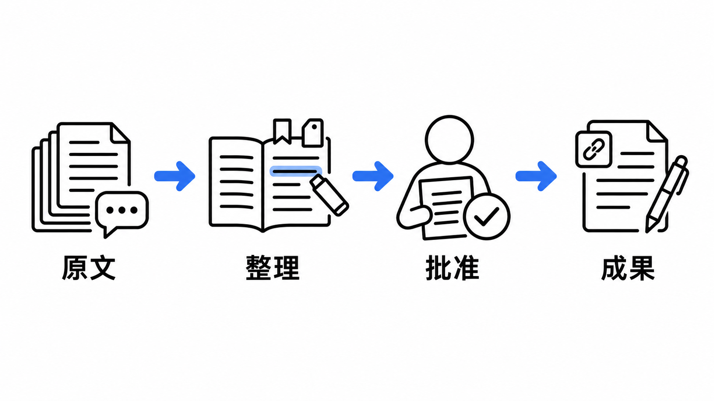
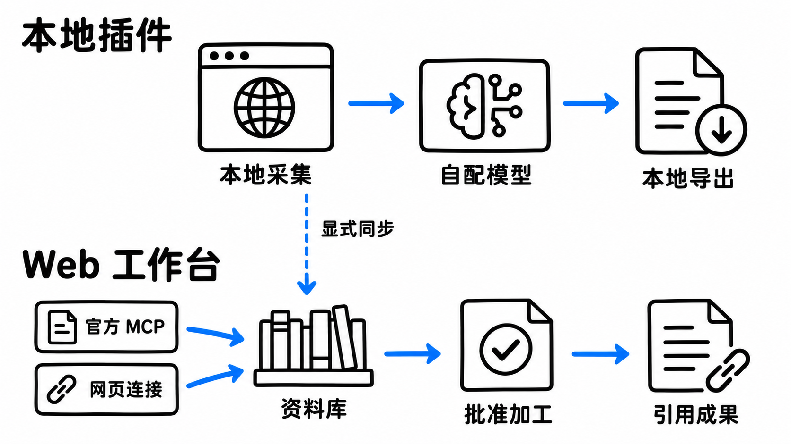

<div align="center">


# 集见 · JIJIAN

**好内容，别只收藏。**

把星球里的讨论，整理成用得上的知识。

知识星球采集 · Chrome / Edge 插件 · 受控 Agent 工作台

[](https://zsxq.51wanai.com/)
[](#快速开始)
[](https://github.com/mitang-ai/zsxq-caiji/releases/latest)

[](https://github.com/mitang-ai/zsxq-caiji/actions/workflows/ci.yml)
[](LICENSE)
[](package.json)
[](https://github.com/mitang-ai/zsxq-caiji/releases/latest)
[](https://github.com/mitang-ai/zsxq-caiji/stargazers)

[能做什么](#能做什么) · [两种用法](#两种用法) · [快速开始](#快速开始) · [浏览器插件](#浏览器插件) · [文档与协作](#文档与协作)



</div>

星球里的帖子、讨论和附件散在不同页面。集见按来源、作者和版本收进资料库；需要总结时，先确认材料与预算，再让模型生成带引用的草稿。之后可以继续编辑、导出，或留在工作台按专题整理。

> **不是一键搬空星球。** 官方 MCP 与网页登录是两条采集通道；网页登录不依赖球主开启 MCP，但两者都只处理当前账号有权访问的内容。缺页、不可见附件与失败阶段会保留覆盖说明，不伪装成完整归档。

## 能做什么

| 你想做的事 | 集见怎么做 |
| :--- | :--- |
| 收集某个星球，或某位成员的内容 | 按星球、作者 ID、时间和内容类型选范围；成员范围始终限于当前星球 |
| 读过之后还能找回来 | 全文搜索、标签、收藏、保存视图、高亮与批注；正文、讨论和原件分别记录覆盖情况 |
| 把零散帖子整理成专题 | 手动选材或规则筛选，冻结材料版本，保留后续成果所引用的原文 |
| 用 AI 深读、研究和总结 | 12 个任务模板，先看选材、模型目的地与调用预算，再批准执行；流程可以保存复用 |
| 修改 AI 稿件，不被重跑覆盖 | 人工稿追加编辑历史；后续分析另出提案，来源变化标记过期，不自动改写你的稿子 |
| 把成果带走 | Markdown、CSV、含原件的可移植 ZIP；插件可本地备份，也可显式同步到工作台 |

模板覆盖单帖深读、讨论综合、成员研究、日报/周报、专题精选、引用问答、SOP、案例与工具、FAQ、观点对照、学习路径和持续跟进。它们是可确认的任务，不是后台无限运行的定时器。

## 两种用法



| | 本地插件 | Web 工作台 |
| :--- | :--- | :--- |
| 来源连接 | 使用你已登录的知识星球网页 | 独立网页登录连接，或个人官方 MCP 连接 |
| 数据存放 | 浏览器 IndexedDB | 私有数据目录中的 SQLite 与原件 |
| 模型调用 | 自配 API，直连你授权的服务 | 在个人设置里配置 Provider |
| 日常操作 | 侧栏采集，完整页面整理与导出 | 资料库、阅读器、专题、任务与个人/团队空间 |
| 是否需要另一端 | **不需要工作台账号** | 不要求安装插件 |

**模型加工和同步都是可选步骤。** 不配模型也能采集、阅读和导出。插件不会自动上传历史，只有预览并确认的材料才会同步；调用外部模型时，所选文本会发送到相应 API，不是完全离线处理。

## 快速开始

准备 **Node.js 24.14+**，推荐使用 `24.14.1`。网页登录需要 Playwright Chromium；Linux 还需对应系统依赖，见 [运行手册](docs/runbook.md)。

```bash
git clone https://github.com/mitang-ai/zsxq-caiji.git
cd zsxq-caiji
npm ci
npx playwright install chromium
npm run build
npm start
```

打开 [http://127.0.0.1:4318](http://127.0.0.1:4318)。Windows PowerShell 可使用 `npm.cmd` / `npx.cmd`。如果端口已有实例，先确认它的用途，不要再启动第二个服务。

1. 创建工作台账号，在「来源与连接」添加连接，自行完成登录或官方 MCP 配置。
2. 选择一个星球和较小时间窗口，先采集、阅读，检查正文与讨论的覆盖说明。
3. 如需加工，在「设置 → 模型」配置 API，发现模型并做一次小测试，再选材、确认预算、批准任务。

数据保存在 `data/`，不随代码提交。生产部署需 HTTPS、独立持久数据目录与非 root 运行用户；小服务器应在本地制作发行包，服务器只解压运行。[发行与部署说明 →](docs/release.md)

## 浏览器插件

**只想使用插件？** 从 [正式发行页](https://github.com/mitang-ai/zsxq-caiji/releases/latest) 下载 Chrome 或 Edge ZIP，解压后加载，不需要安装 Node。[安装、更新与恢复说明 →](docs/plugin-install.md)

开发者完整构建会生成两个插件目录；单独构建也可以：

```bash
npm run build:extension
```

| 浏览器 | 打开管理页 | 开启开发者模式后加载 |
| :--- | :--- | :--- |
| Chrome | `chrome://extensions` | `extension/dist/chrome` |
| Edge | `edge://extensions` | `extension/dist/edge` |

在知识星球网页登录后，从插件侧栏开始采集；完整扩展页用于整理、加工与导出。API Key 可临时保存，或存入需要手动解锁的口令加密保险箱。卸载插件、清理浏览器数据前，先导出本地备份。

插件暂未上架浏览器商店。权限、同步与恢复细节见 [插件说明](extension/README.md)。

## 先看清边界

- **凭据不随分享走。** 连接与模型 Key 归个人；团队成员只能看到授权内容。分享引用原文和附件需另行确认。
- **计费有停点。** 模型请求结果未知时不自动重放；重试需要确认重复计费风险，仍计入原预算。
- **引用固定版本。** 采集新版本不改绑旧稿引用，人工修改有冲突检查。
- **不声称尚未实现的能力。** 目前没有 OCR、音视频转写、向量检索或外部知识系统自动写入。

自动测试使用隔离数据和合成来源/模型，不读取个人浏览器资料，也不调用计费 API。它们验证代码与恢复行为，**不等同于真实星球完整采集、原生权限弹窗或实际模型加工已验收**。[验证范围与重跑命令 →](docs/verification.md)

<details>
<summary><strong>开发与检查</strong></summary>

```bash
npm run typecheck
npm run format:check
npm test
npm run build
npm run test:e2e
npm run test:brand
npm run package:extensions
npm run test:ops
```

单元测试中的隔离浏览器测试需要已安装 Google Chrome；Web E2E 使用 Playwright Chromium。开发时运行 `npm run dev` 和 `npm run dev:web`，详见 [Web 开发说明](web/README.md)。

</details>

## 文档与协作

[插件安装](docs/plugin-install.md) · [更新记录](CHANGELOG.md) · [品牌资产](docs/brand.md) · [正式发行](https://github.com/mitang-ai/zsxq-caiji/releases/latest)

| 想了解 | 从这里看 |
| :--- | :--- |
| 完整功能与限制 | [功能说明](docs/features.md) |
| 服务、存储和权限边界 | [架构](docs/architecture.md) · [数据与 MCP 契约](docs/contracts.md) |
| 启停、冷备、账号恢复和故障处理 | [运行手册](docs/runbook.md) |
| 本地制作 Linux 发行包 | [发行说明](docs/release.md) |
| 测试覆盖与未验证项 | [验证说明](docs/verification.md) |
| 提交修改或报告问题 | [贡献指南](CONTRIBUTING.md) · [安全报告](SECURITY.md) |

后续重点是外部知识系统接入、更多真实来源样本的回归覆盖，以及浏览器商店交付。接口先保持版本化，不通过共享账号、Cookie 或数据库连接产品。

---

<div align="center">

[提交问题](https://github.com/mitang-ai/zsxq-caiji/issues/new/choose) · [查看代码](https://github.com/mitang-ai/zsxq-caiji) · [在线工作台](https://zsxq.51wanai.com/)

如果它帮你把讨论变成了可用的资料，欢迎点一颗 Star，也欢迎带着可复现的问题参与改进。

**MIT License · 米汤**

本项目是独立工具，非知识星球官方产品。两张配图为 AI 生成的流程示意，不是产品截图。

</div>
